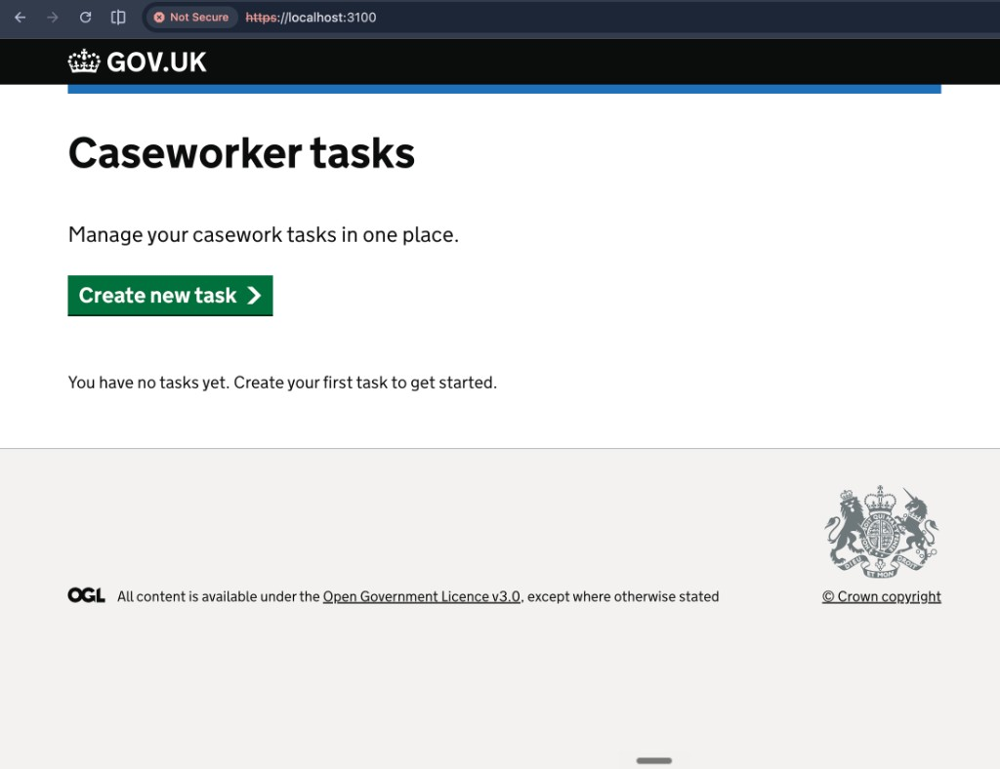
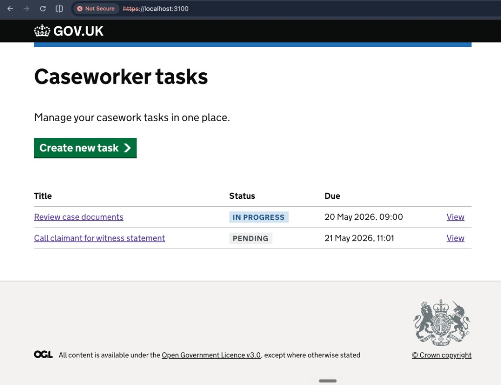
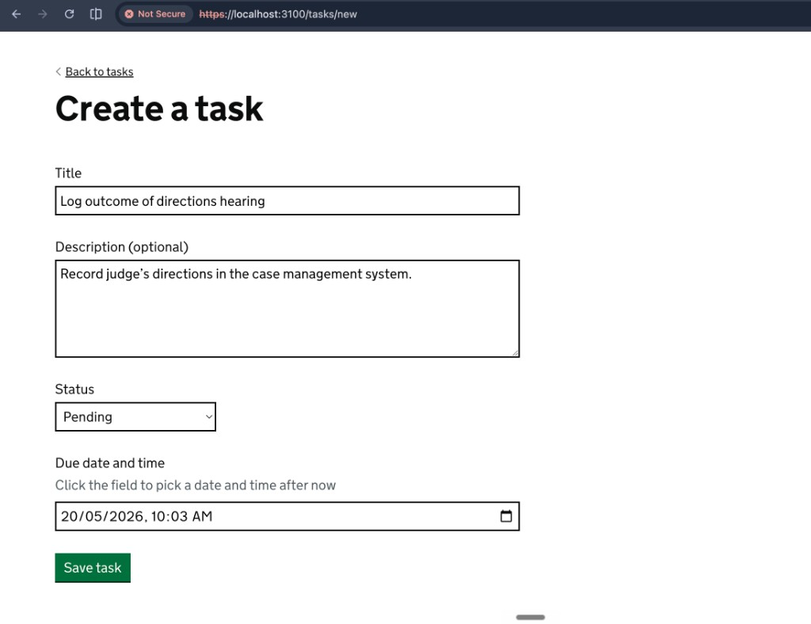
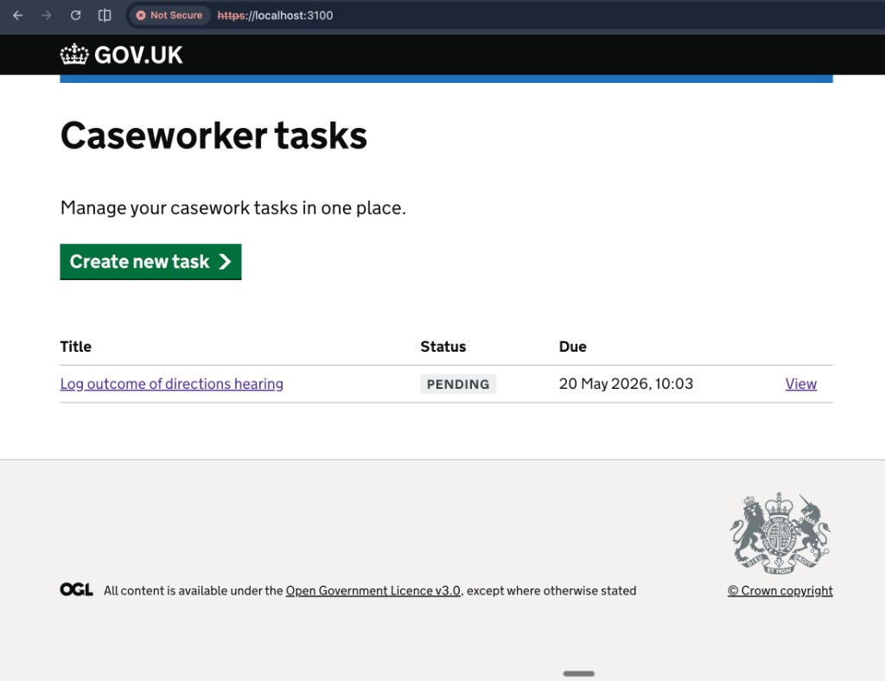
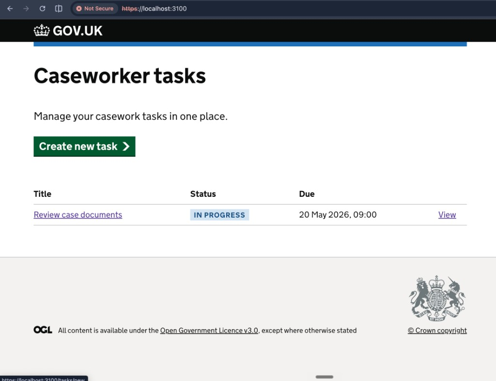
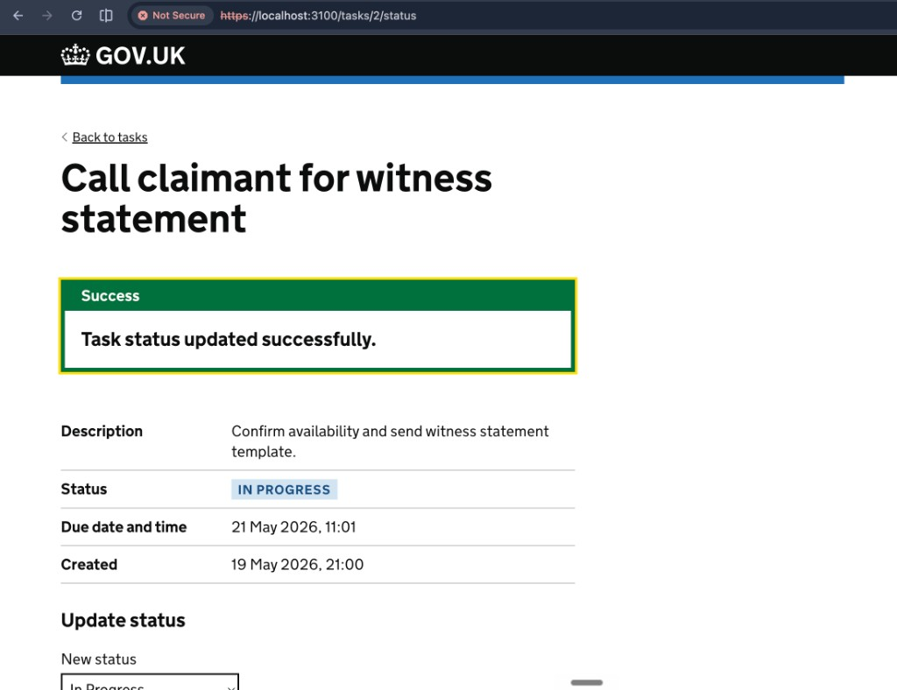
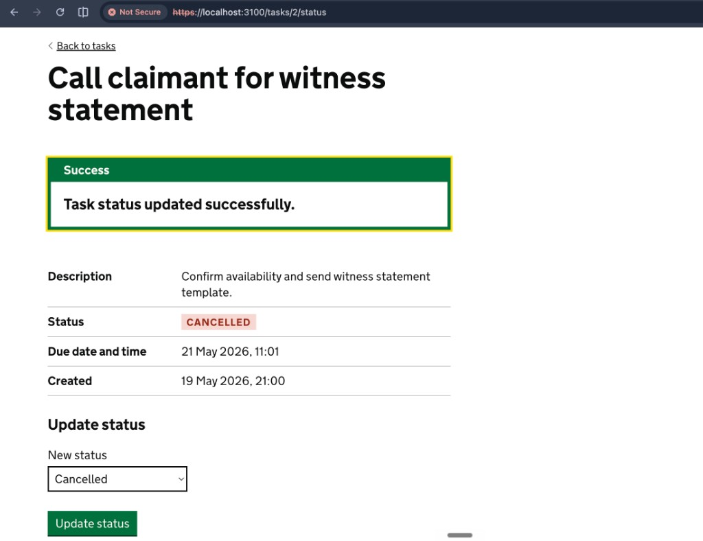
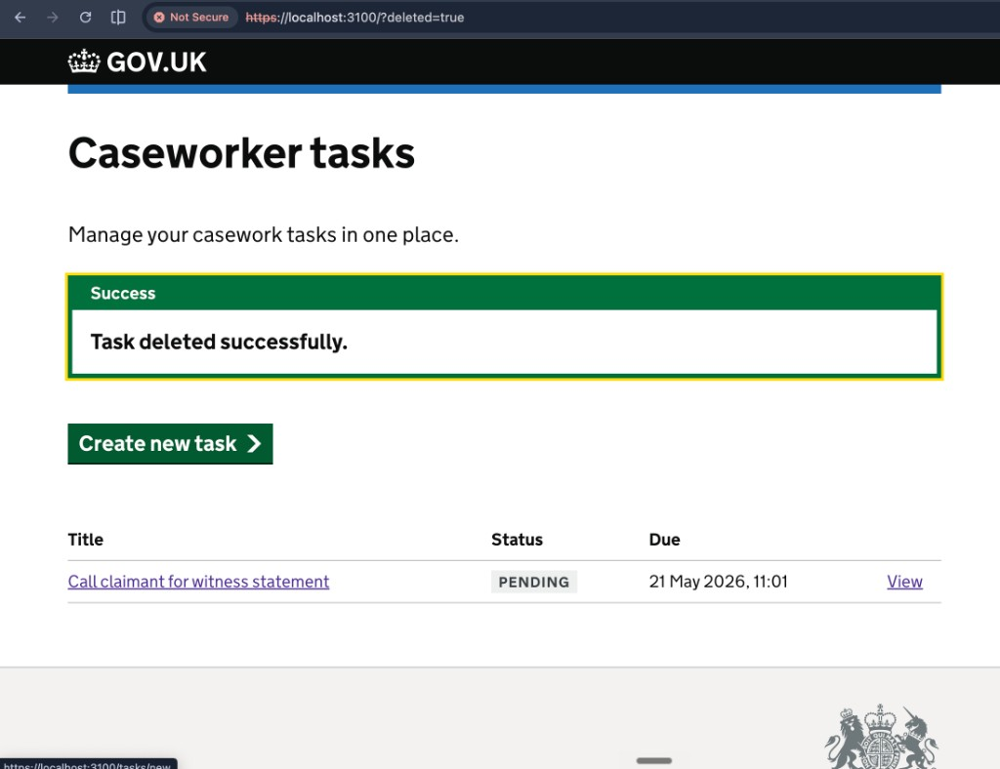

# HMCTS Caseworker Task Management System

**Author:** Samrajj Keezhoth
**Repository:** https://github.com/samrjj32/DTS-TEST

Implementation of the [DTS Developer Technical Test](https://github.com/hmcts/dts-developer-challenge) — a full-stack application that lets HMCTS caseworkers create, view, update, and delete tasks.

Built on the official HMCTS starter projects:

- [hmcts-dev-test-backend](https://github.com/hmcts/hmcts-dev-test-backend)
- [hmcts-dev-test-frontend](https://github.com/hmcts/hmcts-dev-test-frontend)

---

## Overview

Caseworkers need a simple way to track tasks such as reviewing documents, contacting claimants, and preparing for hearings. This solution provides:

- A **REST API** backed by a database
- A **GOV.UK Design System** web UI
- **Validation**, error handling, and **API documentation**
- **Unit and integration tests**

| Layer    | Technology |
|----------|------------|
| Backend  | Java 21, Spring Boot 3, Spring Data JPA, H2 |
| Frontend | Node.js, Express, Nunjucks, GOV.UK Frontend |
| API docs | SpringDoc OpenAPI (Swagger UI) |

---

## Requirements coverage

| Requirement | Implementation |
|-------------|----------------|
| Create task (title, description, status, due date/time) | `POST /api/tasks` + create form |
| Retrieve task by ID | `GET /api/tasks/{id}` + task detail page |
| Retrieve all tasks | `GET /api/tasks` + task list page |
| Update task status | `PATCH /api/tasks/{id}/status` + status form |
| Delete task | `DELETE /api/tasks/{id}` + delete button |
| Frontend CRUD | All flows in the UI (see screenshots) |
| Database | H2 in-memory via JPA |
| Validation & errors | Bean Validation + global exception handler |
| Unit tests | Backend service/controller tests; frontend API & route tests |
| API documentation | Swagger UI at `/swagger-ui.html` |

---

## Screenshots

### Task list (Read)

Empty state when no tasks exist:



Task list with multiple tasks and status tags:



### Create task





### View task (Read)



### Update status






### Delete task



---

## Project structure

```
dts-test/
├── backend/          # Spring Boot REST API
├── frontend/         # Express + Nunjucks UI
├── docs/screenshots/ # UI screenshots for documentation
└── README.md
```

---

## Prerequisites

| Tool | Version |
|------|---------|
| Java | 21 (Gradle can auto-download via `settings.gradle`) |
| Node.js | 20 LTS recommended (see `frontend/.nvmrc`) |
| Yarn | 3 |

---

## Running locally

### 1. Start the backend

```bash
cd backend
./gradlew bootRun
```

Wait for: `Tomcat started on port 4000`

- API: http://127.0.0.1:4000  
- Swagger UI: http://127.0.0.1:4000/swagger-ui.html  
- H2 console: http://127.0.0.1:4000/h2-console  

> **Note:** The backend uses Gradle, not Yarn. Run `./gradlew bootRun` only.

If port 4000 is already in use:

```bash
lsof -ti :4000 | xargs kill -9
./gradlew bootRun
```

### 2. Start the frontend

In a **second terminal**:

```bash
cd frontend
yarn install
yarn webpack
yarn start:dev
```

Open: **https://localhost:3100**

> If you see a stale Yarn PnP error, run `unset NODE_OPTIONS` before `yarn start:dev`.

---

## API reference

| Method | Endpoint | Description |
|--------|----------|-------------|
| `POST` | `/api/tasks` | Create a task |
| `GET` | `/api/tasks` | List all tasks |
| `GET` | `/api/tasks/{id}` | Get one task |
| `PATCH` | `/api/tasks/{id}/status` | Update status only |
| `DELETE` | `/api/tasks/{id}` | Delete a task |

### Task status values

`PENDING` · `IN_PROGRESS` · `COMPLETED` · `CANCELLED`

### Example: create a task

```bash
curl -X POST http://127.0.0.1:4000/api/tasks \
  -H "Content-Type: application/json" \
  -d '{
    "title": "Review case documents",
    "description": "Check submitted evidence",
    "status": "PENDING",
    "dueDateTime": "2026-06-15T14:00:00"
  }'
```

Full interactive documentation: http://127.0.0.1:4000/swagger-ui.html

---

## Running tests

```bash
# Backend — unit + integration tests
cd backend
./gradlew test integration

# Frontend — unit + route tests
cd frontend
yarn test:unit
yarn test:routes
```

---

## Configuration

| Setting | File | Default |
|---------|------|---------|
| Backend port | `backend/src/main/resources/application.yaml` | `4000` |
| API URL (frontend) | `frontend/config/default.json` | `http://127.0.0.1:4000` |
| Frontend port | `frontend/src/main/server.ts` | `3100` |

---

## Architecture

```
Browser  →  Frontend (Express, :3100)  →  Backend (Spring Boot, :4000)  →  H2 database
```

The browser only talks to the frontend. The frontend calls the REST API using Axios. This matches the HMCTS starter pattern (server-rendered pages, not a SPA calling the API directly from the browser).

---

## Further reading

- [Backend README](backend/README.md) — API and Gradle details  
- [Frontend README](frontend/README.md) — UI and Yarn commands  

---

## Licence

MIT (inherited from HMCTS starter repositories).
